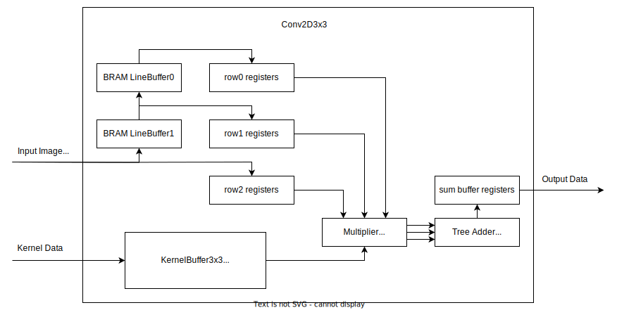

# Convolution 2D 3x3 (Conv2D3x3) IP
This repository contains the FPGA softcore for 2-dimentional convolution optimized for deep learning inference.

For more detail, check out the [implementation doc](./docs/Conv2D3x3-Impl-doc.md)

## Overview
The Convolution 2D 3x3 (Conv2D3x3) IP provides high-bandwidth 2-dimentional convolution against fixed 3x3 filter size. It is optimized for deep learning inference against high channel count input images and kernels. The Conv2D3x3 IP uses AXI4 stream for both data ingress and egress allowing for a cascading configuration.

## Key Features and Benefits
- AXI4 compliant
- Kernel and input image loading with seperate AXI4-Stream ports
- Uses Block RAM for line buffers and kernel buffers
- Tree adder for logarithmic complexity
- Customizable image height, image width, pixel channels.
- Customizable kernel filter count
- Customizable AXI4-Stream width and word width
- Fixed point arithmatic 

| IP Facts Table      |                 |
|---------------------|-----------------|
| Design Files        | Verilog         |
| Test Bench          | SystemVerilog   |
| Simulation tool     | Vivado          |
| Supported Synthesis | Vivado          |

## User Guide
### Port Descriptions
Table: I/O Ports of the Conv2D3x3 module.

| Signal Name       | Signal Type   | Description                                   |
|-------------------|---------------|-----------------------------------------------|
| i_aclk            | Input         | global clock                                  |
| i_aresetn         | Input         | synchronous global reset signal, active low   |
|                   |               |                                               |
| i_img_tvalid      | Input         | Slave AXI4-Stream TVALID for input image data |
| o_img_tready      | Output        | Slave AXI4-Stream TREADY for input image data |
| i_img_tdata       | Input         | Slave AXI4-Stream TDATA for input image data  |
|                   |               |                                               |
| i_kernel_tvalid   | Input         | Slave AXI4-Stream TVALID for kernel data      |
| o_kernel_tready   | Output        | Slave AXI4-Stream TREADY for kernel data      |
| i_kernel_tdata    | Input         | Slave AXI4-Stream TDATA for kernel data       |
|                   |               |                                               |
| o_out_tvalid      | Output        | Master AXI4-Stream TVALID for result data     |
| i_out_tready      | Input         | Master AXI4-Stream TREADY for result data     |
| o_out_tdata       | Output        | Master AXI4-Stream TDATA for result data      |

### Paremeter Descriptions
Table: Parameter constants of the Conv2D3x3 module. Constants must be defined following the listed requirements.

| Paremeter Name        | Requirements                                                              | Description                                       |
|-----------------------|---------------------------------------------------------------------------|---------------------------------------------------|
| IMG_HEIGHT            | IN_HEIGHT >= 3                                                            | Input image height in pixels                      |
| IMG_WIDTH             | IN_WIDTH >= 3                                                             | Input image width in pixels                       |
| WORDS_PER_TRANSFER    | WORDS_PER_TRANSFER >= 1                                                   | Number of words per transfer                      |
| TRANSFERS_PER_PIXEL   | TRANSFERS_PER_PIXEL >= 1                                                  | Number of input image transfers to fill a pixel   |
| WORD_WIDTH            | WORD_WIDTH >= 1                                                           | Width of each word                                |
| FILTERS               | FILTERS % (KERNEL_BUF_WIDTH / (WORDS_PER_TRANSFER \* WORD_WIDTH)) == 0    | Number of filters in the kernel                   |
| KERNEL_BUF_WIDTH      | KERNEL_BUF_WIDTH % (WORDS_PER_TRANSFER \* WORD_WIDTH) == 0                | Width of the kernel buffer port                   |