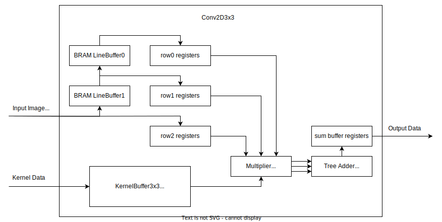

# Convolution 2D 3x3 (Conv2D3x3) IP Implementation Details

This document explains the implementation details of the Conv2D3x3 IP core. This document assumes the 
reader is clear on the theoretical basics of deep learning 2D convolution operation.

## Key Considerations
The Conv2D3x3 IP core is designed to accelerate 2D convolution for deep learning vision tasks. 
To this end, the following constraints are to be considered during implementation.

### 1. Deep Channels
In traditional 2D convolution operations the image to be convolved often only have to deal with 3 channels per pixel for red, green and blue values, a relatively small number. This is however not the case for deep learning 2D convolution. Deep learning 2D convolution often have to deal with an incredibly high number of channels, notably channels often dominate over width and height. For example, one of the 2D convolution layer in the famous ResNet-50 classification model processes an image of shape 14x14x256 (height, width, channels).

### 2. AXI4 Stream interface and Data Order
In order to ensure compatibility, the core must use AXI4-Stream interface to load input image data, load kernel data and output result data. 

Furthermore, the input image data must be the conventional
channel-first order. Where the channel data corresponding to row 0 is transferred first, then the data representing row 1 is transffered, then row 2 and so on. This data order requirement only applies to input image data due to possible hardware limitations outside of user's control. For instance, compatibility with a camera peripheral that transfers in channel-first order. See the following animation for the described data order.

[./media/ImageFillNaive.mp4](https://github.com/JonathanQ-Maker/Conv2D3x3_IP/assets/54139109/44421c53-52a4-49bf-b6ba-bc018051e2b2)

**Video 1:** <ins>Naive animation of how the input image data of 4x4x3 (height, width, channel) are transferred. Assuming at each clock cycle one word/channel can be transferred through the AXI Stream interface. Notice how the order is red channel, green channel, blue channel, then the next pixel in the row and so on.</ins>

On the otherhand, Conv2D3x3 can load a non-conventional kernal data order. This is because the IP core user does have control over the kernel data. This freedom gives more flexibility for a more optimal implementation.

Finally, the result data must also follow the data order of the input data. This is because it allows cascading 2D convolution operations togeather. Which is a common practice in deep learning vision tasks. Consider, again, the ResNet-50, the suffix "50" means 50 layers of 2D convolution processors.

### 3. Partial Results
The input image to be convolved on would likely be too big to fit in on-chip memory. Therefore, as the input image data is being loaded into the core, computation should start as soon as possible to produce partial results. This would allow the core to evict the partial results quickly thereby incur less on-chip memory usage.

### 4. Inferring Block RAM
It is unavoidable to have to use up on-chip memory, we can however, avoid wasting the more valuable on-chip memory. Namely by using block RAM over registers for large buffers. To this end, the implementation should allow the synthesis tool to infer block RAM when it deems nessesary. Generally, this means synchronus read and write, using one read port and one write port on any buffer, and finally, using synchronus resets.

### 5. Fixed 3x3 Filter Size
In deep learning, vast majority of the 2D convolution operations are conducted with a filter shape of 3x3xC where C is the number of channels. Notably, C varies a lot more than the width and height of the filter. Therefore, a design decision is made to simplify the implementation by fixing the Conv2D3x3 IP's filter width and height at 3x3.

## The Implementation
This section outlines each sub-module in the Conv2D3x3 IP core.

**Figure 1:** <ins>The implementation block diagram of Conv2D3x3 IP core.</ins> 

### 1. BRAM Line Buffer and Row Registers
When the input image data first gets streamed into the Conv2D3x3 core, it is immediately buffered into row registers and BRAM line buffers (line buffers from now on). The Line buffer is a synchronus dual port block RAM based FIFO, row registers is a collection of shift registers. 

The row registers are used for their ability to accessed all the data stored within the buffer at the same time. Therefore, the row register acts as a serial-to-parallel converter. With 3 row registers, the filter's 3x3 window can be accessed in parrallel.

Between each row register is a line buffer, the line buffer's goal is to delay the input image data such that the row registers have the correct 3x3 window loaded. The following is an animation showing line buffers and row registers in action on a 4x4 image.

[./media/ImageFillBuffers.mp4](https://github.com/JonathanQ-Maker/Conv2D3x3_IP/assets/54139109/0168fa74-7465-4069-a3b7-c20b7cc7cb92)

**Video 2:** <ins>Animation of how a 4x4x1 input image data is loaded into the line buffers and row registers. Notice how the line buffer delay data such that the row registers would form the correct 3x3 window. This window is then later be used with the kernel to perform the 2D convolution.</ins>

Notice in the above animation that the input image only has one channel, in the actual implementation, extra logic is needed to handle the channel depth.
